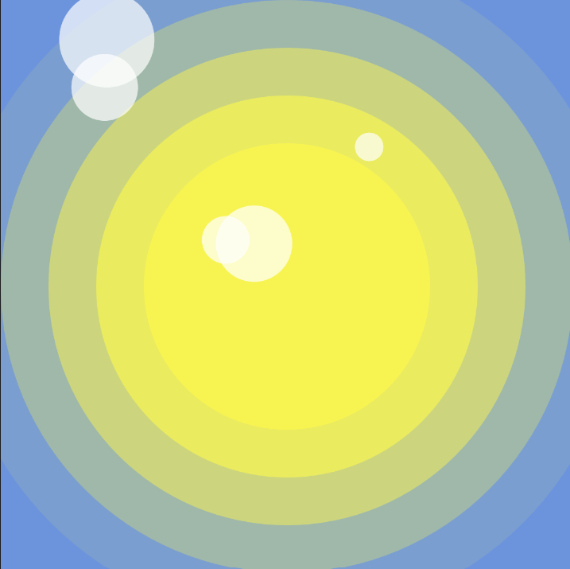
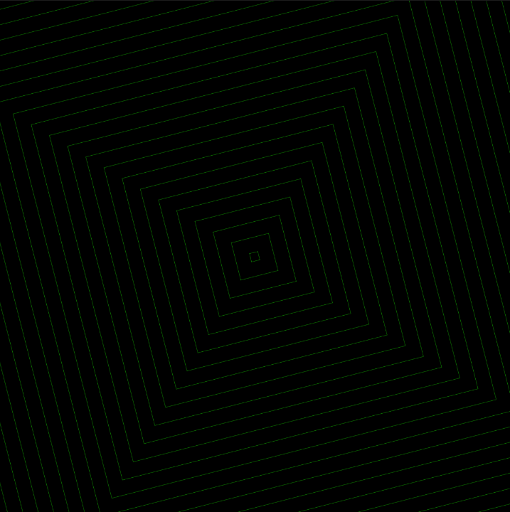
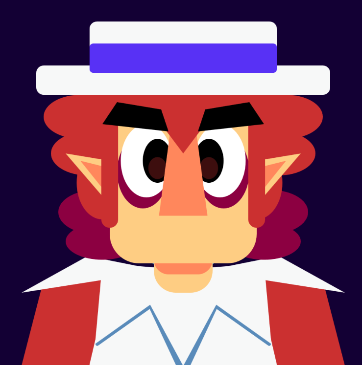

# my computers houses (computer house)
it is cart253

<i> otherwise, i put my class stuff here, which i am okay at doing sometimes</i> 

<i>you can catch some of my other work on https://havenfolio.neocities.org/</i> 

# some other stuff

 <a href="https://github.com/snailfan300/cart253/blob/main/journal.md">text journals</a> 

# prototypes
<h2>JAVASCRIPT PROTOS</h2>

 A handful of Javascript prototypes built using the <a href="https://p5js.org">P5 library.</a> 

<h3>Prototype A: "Pleasant Sun"</h3>

I am a creative title person. A nice sun with the illusion of a gradient created using more stacked circles with alpha transparency. Featuring some clouds that rotate around the center when the code is running. I have a bit of a personal bias towards js projects that actually move and aren't purely static.

>- Running project can be found <a href="https://snailfan300.github.io/cart253/prototypes/template-p5-project/index.html">here</a>

<h3>Prototype B: "Repeated Square"</h3>

Visual project using a for loop to repeat instances of a rotating square in the center. I almost repeated the code by copy/pasting the lines manually, until I remembered that P5 has a "for" function that's infinitely more optimized than what I was about to do.

> - Running project can be found <a href="https://snailfan300.github.io/cart253/prototypes/template-p5-project/repeatedsquare.html">here</a>

<h3>Prototype C: "Pent Portrait"</h3>

Something weird I felt like doing for the love of the game. Mostly relying on P5's "translate" function because I am very bad at js coordinates when it comes to 2D shapes. Symmetrical portrait of Pent from Supermental.

> - Running project can be found <a href="https://snailfan300.github.io/cart253/prototypes/template-p5-project/pentportrait.html">here</a>
